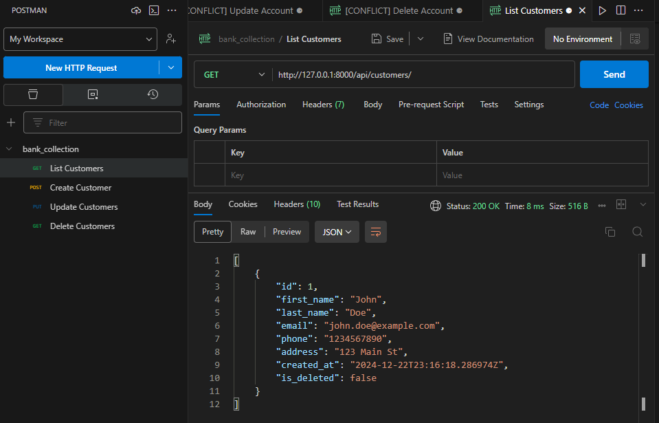
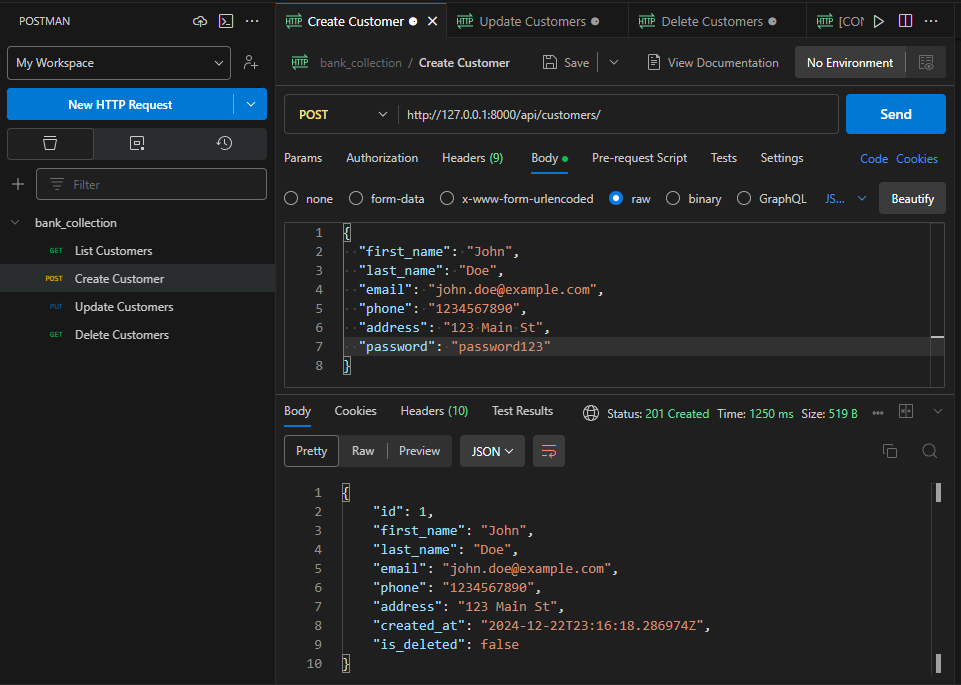
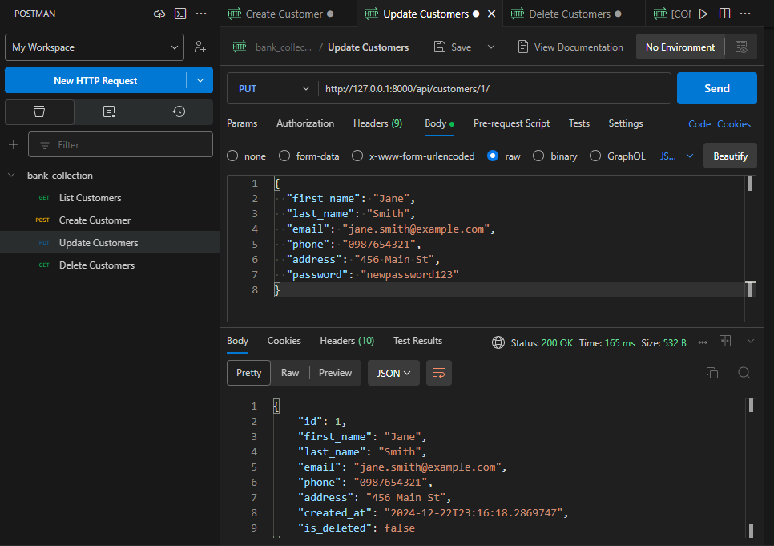
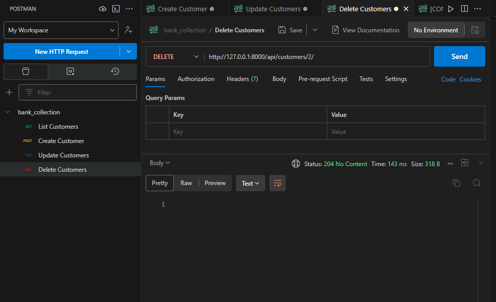

# Simple-Banking-System--GROUP 1
This is a mini API project for a simple banking system

## Group members
- `122787`
- `152257`
- `151956`
- `149013`
- `151775`
- `150914`
- `151366`

## Project Setup
  **_Note to work with Django, Working under Virtual env is recommended_**
  - install a virtual env `pip install virtualenv`
  - make a virtual environment `mkvirtualenv env_name`
  - listing all virtual environments `lsvirtualenv`
  - To activate a virtual env `venv_name\Scripts\activate`
  - switching to specific virtual environment `workon 'env_name'`
    
# Running the app
_To run the app_
- Clone the repo
- In the app directory, switch to the created virtual environment `workon 'env_name'` and in the virtual env, you can begin work.
- In the virtual env, install django `pip install django` and the rest framework `pip install djangorestframework`
- Create migrations `py manage.py makemigrations` and migrate them `py migrate.py migrate`
- Run the server `py manage.py runserver` to interact with the app

## Project Implementation

### _Models and Their Relationships_

- **Account**: Represents a bank account with fields such as `account_number`, `account_holder`, `balance`, etc.
- **Transaction**: Represents a transaction with fields such as `transaction_id`, `account`, `amount`, `transaction_type`, etc. Each transaction is linked to an account, establishing a one-to-many relationship.
- **Customer**: Represents a customer with fields such as `first_name`, `last_name`, `email`, `phone`, `address`, `password`, etc. Each customer can have multiple accounts, establishing a one-to-many relationship.

### _Views/Viewsets and Their Roles_

- **AccountViewSet**: Handles CRUD operations for accounts. It includes methods for listing, retrieving, creating, updating, and deleting accounts.
- **TransactionViewSet**: Handles CRUD operations for transactions. It includes methods for listing, retrieving, creating, updating, and deleting transactions.
- **CustomerViewSet**: Handles CRUD operations for customers. It includes methods for listing, retrieving, creating, updating, and deleting customers.

### _Serializers and Validation Rules_

- **AccountSerializer**: Serializes account data and includes validation rules for fields such as `account_number` and `balance`.
- **TransactionSerializer**: Serializes transaction data and includes validation rules for fields such as `amount` and `transaction_type`.
- **CustomerSerializer**: Serializes customer data and includes validation rules for fields such as `email` and `password`.

### _URL Patterns and Their Purpose_

- **/accounts/**: Endpoint for listing and creating accounts.
- **/accounts/{id}/**: Endpoint for retrieving, updating, and deleting a specific account.
- **/transactions/**: Endpoint for listing and creating transactions.
- **/transactions/{id}/**: Endpoint for retrieving, updating, and deleting a specific transaction.
- **/customers/**: Endpoint for listing and creating customers.
- **/customers/{id}/**: Endpoint for retrieving, updating, and deleting a specific customer.

These URL patterns map to the corresponding viewsets, enabling the API to handle requests for account, transaction, and customer operations.

## _Test Results_

The following tests were performed to ensure the functionality of the Simple Banking System API:

### _Customer Tests_

- **test_get_customer_list**: Passed (Status Code: 200 OK)
  

- **test_create_customer**: Passed (Status Code: 201 Created)
  

- **test_update_customer**: Passed (Status Code: 200 OK)
  
  
- **test_delete_customer**: Passed (Status Code: 204 No Content)
  

*_All tests were executed successfully, confirming that the API endpoints for accounts, transactions, and customers are functioning as expected._*

